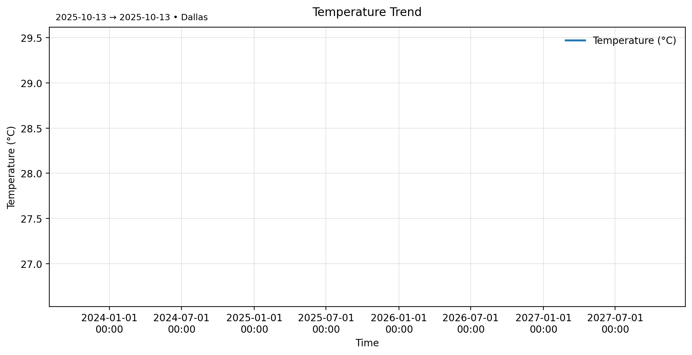
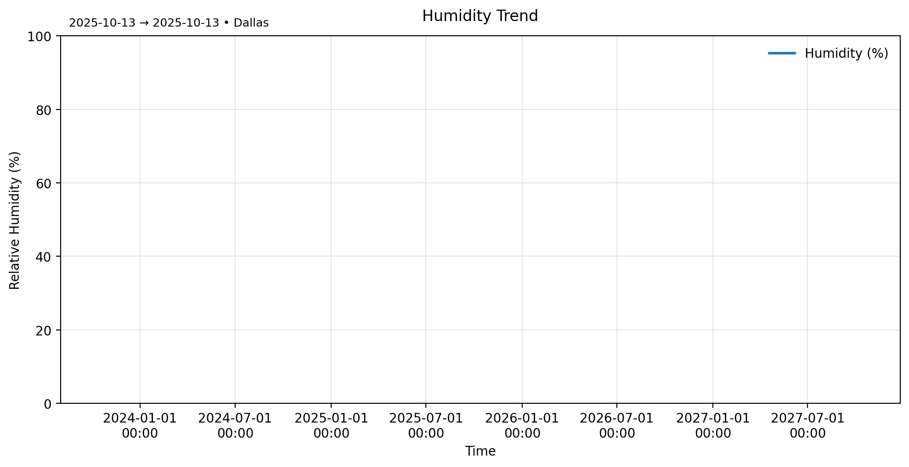

## Data Extraction Process

1. **Set up virtual environment**
   ```bash
   python -m venv venv
   source venv/bin/activate  # Mac/Linux
   venv\Scripts\activate     # Windows
   pip install -r requirements.txt


Transformation complete. 
## Visuals

Temperature trend  


Humidity trend  


Weather overview (Temperature & Humidity)  

## Final Touches ($timestamp)

- Pushed latest scripts in `src/` and `scripts/`
- Added/updated visuals in `reports/` and `visuals/`
- Confirmed `.gitignore` excludes local DB and raw data
- Verified repo structure and usage steps

### Repo Structure (key paths)
```
src/                 # extraction, transform, load modules
scripts/             # one-off utilities & plotting scripts
data/                # raw/processed (raw/ & DB ignored)
reports/             # generated charts/figures
visuals/             # presentation-ready images
```

### Quick Start
```bash
python -m venv venv
source venv/bin/activate
pip install -r requirements.txt
python src/extract.py
python src/transform.py
python src/load.py
python scripts/plot_temperature_trend.py
```
