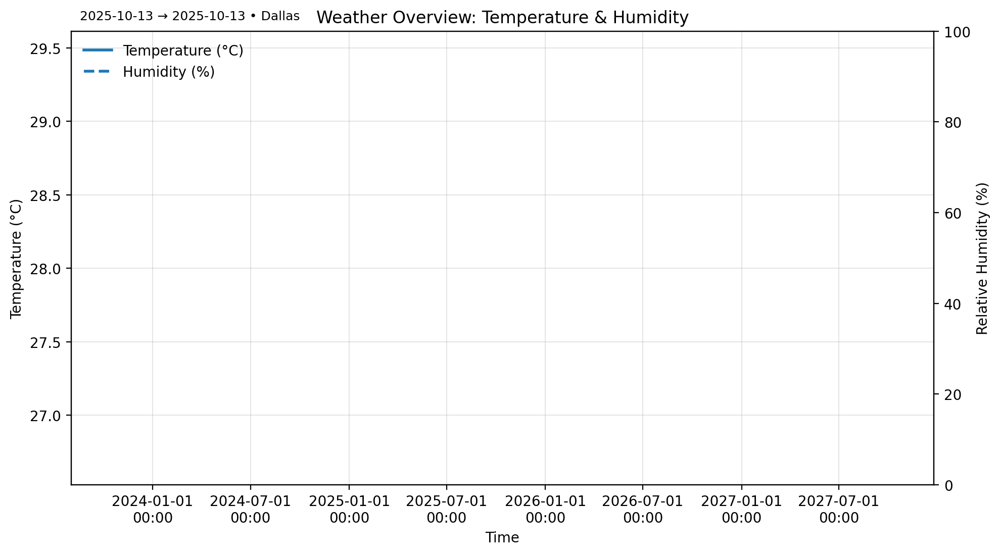

## Data Extraction Process

1. **Set up virtual environment**
   ```bash
   python -m venv venv
   source venv/bin/activate  # Mac/Linux
   venv\Scripts\activate     # Windows
   pip install -r requirements.txt


Transformation complete. ✅
## Visuals

Temperature trend  


Humidity trend  


Weather overview (Temperature & Humidity)  

